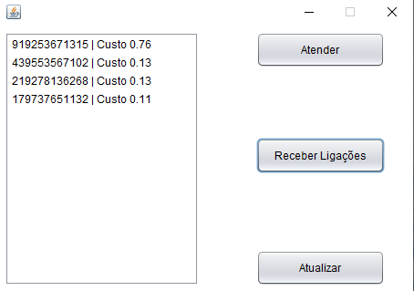

**Resumo:**

- A partir de quanto maior a distância entre o DDD(19) da central e o DDD que está ligando à central, bem como maior o tempo de espera na linha, maior deve-se a prioridade de atendimento, **evitando assim custos desnecessários**.
- Nós pegamos todas as coordenadas geográficas (Latitude e Longitude) aproximadas dos DDDs e calculamos a distância entre a coordenada geográfica do número que está ligando até a coordenada geográfica do DDD 19. Para fazer esse cálculo usamos a **fórmula de haversine**, que é uma importante equação usada para navegações,a partir da latitude e longitude dos dois pontos calculando a distância entre eles. Assim podemos calcular a distância com a seguinte fórmula: 

- Fizemos uma pesquisa e identificamos que o maior custo de ligação por minuto é de R$ 1,05. Pegamos a distância entre Roraima e Campinas em KM e chegamos a um valor de : R$ 0,00031992687 por minuto de ligação por KM.
- Assim elaboramos a fórmula do custo de ligação:

|
C = 0,00031992687; // Custo por Minuto por KM

D; //Distância em KM até o DDD 19

CF; // Custo final

T; // Tempo de espera da ligação em Minutos

CF = ([D \* C] + 0,01) \* T; 
|
| - |

- Foi adicionado uma taxa fixa de R$ 0,01 para compensar as ligações realizadas do DDD 19. Veja exemplo caso não tivéssemos a taxa fixa:

|
C = 0,00031992687; // Custo por Minuto por KM

D = 0; //Distância em KM até o DDD 19

CF; // Custo final

T = 10; // Tempo de espera da ligação em Minutos

CF = ([D \* C]) \* T;  // Se não tivesse taxa fixa

CF  = 0 \* 0,00031992687 \* 10;

**CF = 0; // Valor da ligação do DDD 19 seria sempre R$ 0,00 independente do tempo esperando ser atendido**
|
| - |
- O programa tem uma função que simula o atendimento e recebimento de ligações.
- Detalhes da Interface:
  - **Botão Atende**r: Esse botão irá atender a primeira chamada da lista(que têm maior prioridade).
  - **Botão Receber Ligações**: Esse botão irá simular o recebimento de ligações, gerando os números na lista de ordem prioritária.
  - **Botão Atualizar**: Esse botão atualiza a lista, aumentando o custo da ligação de acordo com o tempo e a distância da ligação.
  - **Listagem de Ligações**: Uma lista de ligações não atendidas ordenadas por custo da ligação.

**Documentação**

|Classe Coordinates|
| :-: |
|Método|Coordinates(double lat, double long) |Inicializa a classe Coordenadas, atribuindo uma Latitude e uma Longitude|
|Método|distance(Coordinates x)|Retorna a distância em KM entre duas coordenadas geográficas|
|Método|haversin(double val)|Retorna o resultado da fórmula de haversine|

|Classe Interface|
| :-: |
|Método|Interface()|Inicializa os elementos da interface gráfica e as variáveis necessárias|
|Método|initComponents()|Inicializa os elementos da interface gráfica (Método gerada pelo NetBeans)|
|Método|jButton1ActionPerformed()|Ação de clique do botão 1. Botão que simula o recebimento de ligações|
|Método|jButton3ActionPerformed()|Ação de clique do Botão 3. Botão que atualiza a lista, organizando as ligações por custo|
|Método|jButton2ActionPerformed()|Ação de clique do Botão 2.  Botão que simula atender ligações.|
|Método|main()|Classe que inicia o programa|
|Método|organizeElements()|Classe que organiza os elementos em uma pilha de acordo com o seu custo.|
|Método|displayOrder()|Classe que realiza a exibição dos itens de acordo com a pilha ordenada|
|Método|getStack()|Classe que retorna a pilha de itens que ainda não foram ordenados.|

|Classe DDD |
| :-: |
|Método|DDD|Inicializa a classe DDD com definindo os DDDs possíveis|
|Método|getCoordinate()|Retorna as coordenadas para cada um dos DDDs existentes.|
|Método|available(Int ddd)|Retorna se o DDD é válido|
|Método|getDDDs()|Retorna todos os DDDs válidos|

|Classe List|
| :-: |
|Método|List<T>|Cria uma Pilha de lista encadeada|
|Método|push()|Insere um novo valor a Pilha |
|Método|isEmpty()|Verifica se não existe elementos na Lista|
|Método|peek()|Seleciona o valor que está no topo da Pilha|
|Método|pop()|Remove o elemento do topo da Pilha, retornando-o.|
|Método|display()|Imprime no console todos os elementos da Pilha.|

|Classe Node|
| :-: |
|Método|setData()|Define um dado para o elemento|
|Método|getData()|Retorna os dados do elemento|
|Método|getNext()|Retorna o elemento seguinte |
|Método|setNext()|Define o próximo elemento|

|Classe Phone|
| :-: |
|Método|getCost()|Retorna o custo da ligação telefônica.|
|Método|getFormatedPhone()|Retorna o número do celular|
|Método|getDDD()|Retorna o DDD do celular|
|Método|toString()|Converte elementos para string|

|Classe Simulator|
| :-: |
|Método|makeRandomPhoneCalls()|Cria chamadas telefônicas aleatórias|
|Método|random()|Gera números inteiros aleatórios|
|Método|createsNumber()|Cria um número de celular de forma aleatória|

**Bibliografia:**

- **Fórmula de Haversine**

https://pt.wikipedia.org/wiki/F%C3%B3rmula\_de\_haversine

- **Latitudes e Longitudes por DDD**

https://gist.github.com/viebig/246bdc5970eedc95c02d

- **Custo de Ligações**

https://agenciabrasil.ebc.com.br/geral/noticia/2018-02/ligacoes-locais-e-interurbanas-de-fixo-para-movel-ficarao-mais-baratas#:~:text=O%20pre%C3%A7o%20m%C3%A9dio%20das%20liga%C3%A7%C3%B5es,para%20R%24%200%2C39.

https://canaltech.com.br/telecom/Ligacoes-entre-celulares-ficarao-50-mais-baratas-em-2016/ 

